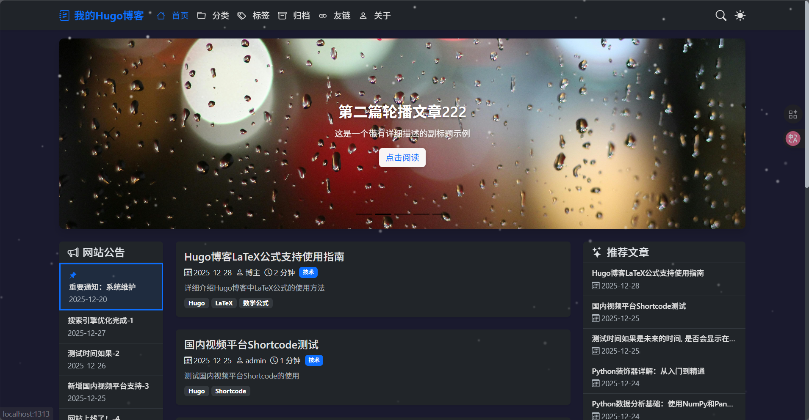
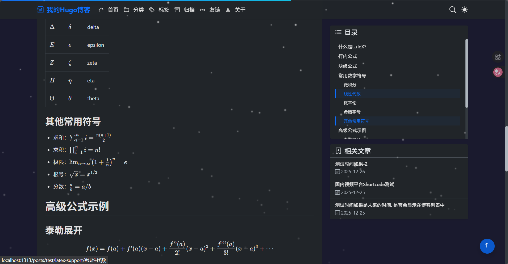
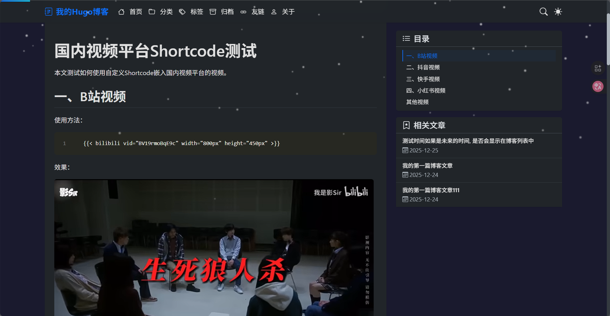
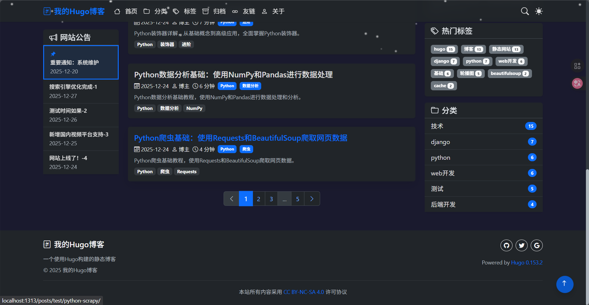
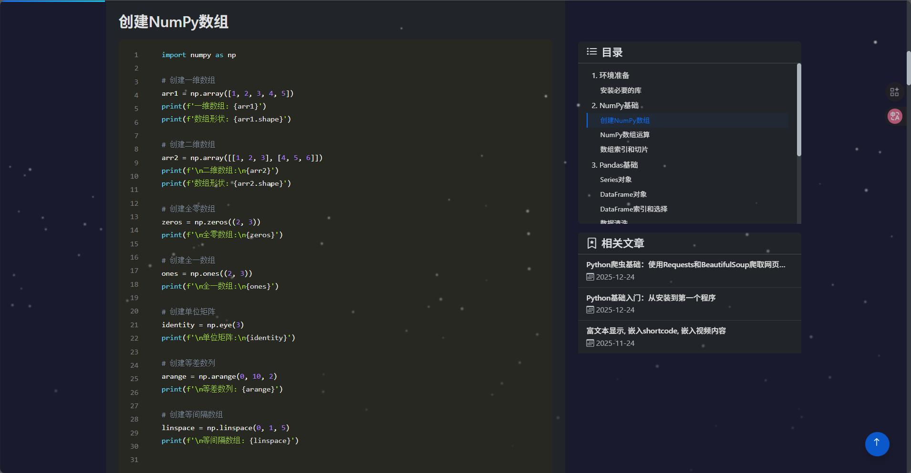
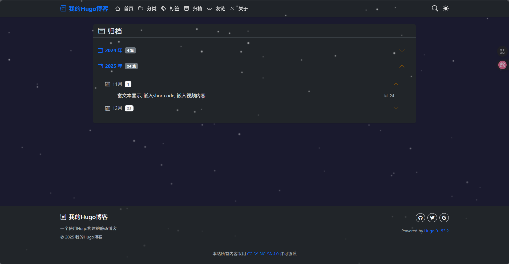
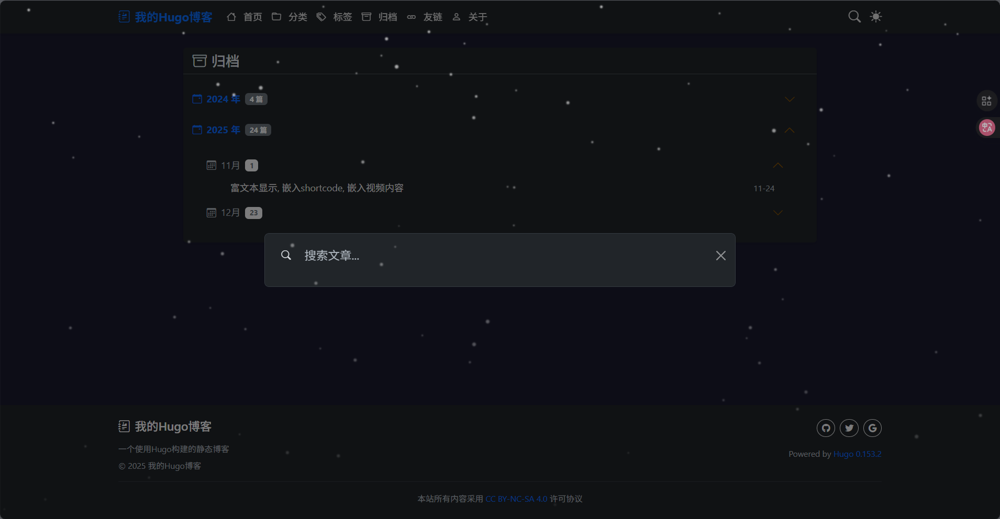

# Hugo博客

## 0. Hugo博客

本项目是一个基于Hugo静态站点生成器构建的现代化博客系统，采用Bootstrap框架进行样式设计，具有响应式布局，适配各种设备。

## 1. 项目总览

### 系统特点

本博客系统具有以下特点：
- 基于Hugo静态站点生成器，构建速度快，部署简单
- 采用Bootstrap框架，响应式设计，适配各种设备
- 支持通知公告和轮播图功能
- 集成站内搜索功能
- 支持第三方评论系统
- 易于自定义和扩展

### 系统截图

<div style="display: flex; flex-wrap: wrap; gap: 10px; justify-content: center;">
  
  
  
  
  
  
  
</div>

## 2. 主要板块

- **首页**：包含轮播图、公告栏和文章列表
- **分类页**：按文章分类展示内容
- **标签页**：按标签聚合相关文章
- **归档页**：按时间顺序展示所有文章
- **友链页**：展示友情链接
- **关于页**：展示博客和博主信息

## 3. 通知和轮播图原理

### 通知功能

**使用方法**：
- 在`content/notice/`目录下创建Markdown文件，每个文件对应一条公告
- 公告会自动显示在桌面端侧边栏和移动端顶部
- 支持多条公告同时显示，按时间顺序排序

### 轮播图功能

**使用方法**：
- 在`content/carousel/`目录下创建Markdown文件，每个文件对应一个轮播项
- 轮播图图片存储在`static/carousel/`目录下，命名格式为`01.jpg`、`02.jpg`等
- 支持jpg和png格式图片
- 最多显示5个轮播项
- 支持自动轮播和手动控制

## 4. 项目配置

### 关键配置文件

- **`config.toml`**：博客的主要配置文件，包含：
  - 站点基本信息（标题、作者、描述等）
  - 菜单配置
  - 分页设置
  - Markdown渲染配置
  - 搜索功能配置
  - 评论系统开关

### 重要配置项

```toml
# 站点基本信息
baseURL = "http://example.org/"
title = "我的Hugo博客"
author = "博主"

# 分页配置
[pagination]
  pagersize = 6  # 每页显示文章数量

# 搜索配置
[outputs]
  home = ["HTML", "RSS", "JSON"]  # 输出JSON用于搜索

# 评论系统开关
[params]
  comments = true  # true为开启，false为关闭
  showFeaturedImage = true  # 是否显示文章特色图片
```

## 5. 搜索引擎原理

本博客集成了站内搜索功能，**基于文章标题进行全局搜索**。

### 实现原理

1. **搜索索引生成**：
   - Hugo在构建时自动生成`search.json`文件，包含所有文章的索引信息
   - 索引内容包括文章标题、URL、发布日期、分类、标签和内容摘要

2. **搜索功能实现**：
   - 使用JavaScript实现前端搜索逻辑，位于`assets/js/main.js`
   - 支持实时搜索，输入关键词即可显示匹配标题的搜索结果
   - 支持搜索结果高亮显示

## 6. 快速开始

### 6.1 安装Scoop

**默认安装位置**：`C:\Users\用户名\scoop`

```bash
# 安装Scoop（需要PowerShell 5.1+）
Set-ExecutionPolicy RemoteSigned -Scope CurrentUser
irm get.scoop.sh | iex
```

### 6.2 使用Scoop安装Hugo

```bash
# 安装Hugo扩展版（推荐）
scoop install hugo-extended

# 检查Hugo版本
hugo version
```

### 6.3 克隆项目

```bash
# 克隆本项目
git clone <项目仓库地址>
cd <项目目录>
```

### 6.4 启动项目

```bash
# 启动本地开发服务器
hugo server -D
```

## 7. 本地开发指南+常见命令

### 7.1 本地开发流程

1. 克隆项目到本地
2. 安装依赖（本项目无需额外依赖）
3. 启动本地开发服务器
4. 在浏览器中访问 `http://localhost:1313`
5. 修改内容后自动刷新预览

### 7.2 常见命令

```bash
# 指定ip+端口号--手机使用edge浏览器访问效果最佳
✅ 完美版：hugo server --bind 0.0.0.0 --port 8080 --baseURL=http://10.99.126.182:8080

✅ 缩写版：hugo server --bind 0.0.0.0 -p 8080 -b "http://10.223.173.182:8080"

❌ 错误版：hugo server -b 0.0.0.0 -p 8080 ... # -b 被误认为绑定地址

# 基础启动本地服务器（默认端口1313，实时预览）
hugo server

# --disableFastRender：禁用快速渲染，每次更改都完整重新构建
hugo server -D --disableFastRender

# 显示草稿+自定义端口（开发调试常用）
hugo server -D --port 8080  # -D显示草稿，--port指定端口为8080

# 显示未来发布的文章+关闭快速渲染（调试样式用）
hugo server -F --disableFastRender  # -F显示未来文章

# 基础构建（输出到public目录）
hugo

# 自定义输出目录
hugo -d ./dist # 将静态文件输出到dist目录（替代默认public）
```

## 8. 联系方式

- QQ邮箱：2630880751@qq.com
- 欢迎fork和star